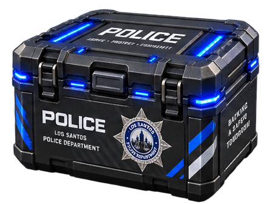

<div align="center">

# 📦 KG Scripts — Police Loot Box

**A clean, optimized, and plug-and-play Police Armory Loot Box resource for FiveM.**  
Built natively for **Qbox (`qbx_core`)** and **`ox_inventory`**.

[](https://fivem.net/)
[](https://www.lua.org/)
[](https://github.com/KandianTM/Police-box)
[](LICENSE)

<br/>



</div>

---

## ✨ Features

- 🎯 **Plug & Play**: 100% standalone logic compatible with Qbox Framework & ox_inventory.
- 🎁 **Dynamic Loot Pools**:
  - **Guaranteed Rewards**: Always reward essential police gear (e.g., service pistol, handcuffs, armor, ammo).
  - **Random Armory Pool**: Configurable weighted chances and min/max rolls for specialized items (taser, rifle, shotgun, spike strips, radio, medikits).
- 🛡️ **Inventory Overflow Safety**: Automatically detects full inventory capacity (`CanCarryItem`) and safely creates a ground drop (`CustomDrop`) at the player's feet so no loot is lost.
- ⚡ **Anti-Spam & Exploit Protection**: Server-side verification ensures players own the box, removes it on start, and prevents multiple simultaneous openings.
- 🎬 **Custom Progress & Animation**: Smooth progress bar with opening animation and attached prop.
- 📢 **Discord Webhook Logging**: Optional rich embedded Discord logs with player names, Citizen IDs, and all awarded items.
- 🚀 **0.00ms Resmon**: Fully idle when not in use.

---

## 📋 Requirements & Dependencies

Make sure your FiveM server has the following dependencies installed and started:

- [**ox_lib**](https://github.com/overextended/ox_lib)
- [**ox_inventory**](https://github.com/overextended/ox_inventory)
- [**qbx_core**](https://github.com/Qbox-project/qbx_core)

---

## 🚀 Installation Guide

### Step 1: Place Resource
1. Clone or download this repository.
2. Rename the folder to `police_box` (if named differently).
3. Place it inside your server's `resources` directory (e.g. `resources/[standalone]/police_box` or `resources/[qbx]/police_box`).

```
server-data/
└── resources/
    └── [standalone]/
        └── police_box/
            ├── client/
            ├── server/
            ├── Item_Png/
            ├── config.lua
            ├── fxmanifest.lua
            └── README.md
```

---

### Step 2: Register Item in `ox_inventory`

1. Open `ox_inventory/data/items.lua` in your code editor.
2. Add the following item definition inside the items table:

```lua
['police_lootbox'] = {
    label = 'Police Loot Box',
    weight = 2500,
    stack = true,
    close = true,
    description = 'A secure police crate packed with official department armory equipment and supplies.',
    client = {
        image = 'police_lootbox.png',
    }
},
```

---

### Step 3: Add Inventory Item Image

1. Copy `police_lootbox.png` from the `Item_Png/` folder included in this resource.
2. Paste it into your `ox_inventory` image folder:
   ```
   ox_inventory/web/images/police_lootbox.png
   ```

---

### Step 4: Add to `server.cfg`

Open your `server.cfg` and ensure the resources are started in the correct order:

```cfg
# Dependencies (Must start before police_box)
ensure ox_lib
ensure ox_inventory
ensure qbx_core

# Resource
ensure police_box
```

---

## 🎮 How to Test & Use In-Game

1. **Start the resource** (or restart server):
   ```
   refresh
   start police_box
   ```

2. **Give yourself the item**:
   - Via `ox_inventory` command:
     ```
     /giveitem me police_lootbox 1
     ```
   - Via `qbx_core` command:
     ```
     /additem 1 police_lootbox 1
     ```

3. **Use the item**:
   - Open inventory (`TAB` or `F2`).
   - Use the item by right-clicking or dragging it to your hotbar.
   - The opening animation will play and loot will be deposited directly into your inventory!

---

## ⚙️ Configuration (`config.lua`)

All behavior, animations, loot tables, and discord logging can be tailored inside `config.lua`:

### 🛠️ Animation & Progress Bar
```lua
Config.Opening = {
    Duration = 5000, -- Duration in milliseconds (5 seconds)
    Label = 'Opening Police Loot Box...',
    Animation = {
        Dict = 'anim@gangops@facility@servers@bodysearch@',
        Clip = 'player_search',
        Flag = 49
    },
    Prop = {
        Enabled = true,
        Model = 'prop_cs_box_clothes',
        Bone = 28422,
        Pos = vec3(0.0, -0.05, -0.05),
        Rot = vec3(0.0, 0.0, 0.0)
    }
}
```

### 🎁 Loot Rewards Customization
```lua
Config.Rewards = {
    -- Guaranteed Items: ALWAYS given to player
    Guaranteed = {
        { name = 'weapon_combatpistol', min = 1, max = 1, chance = 100, metadata = { durability = 100, generateSerial = true, description = 'Police Standard Issue Pistol' } },
        { name = 'ammo-9',              min = 50, max = 100, chance = 100 },
        { name = 'armour',              min = 1, max = 2, chance = 100 },
        { name = 'handcuffs',           min = 1, max = 2, chance = 100 }
    },

    -- Random Item Pool: Rolls between MinItems and MaxItems from this array
    RandomRolls = {
        MinItems = 2, -- Minimum number of random items rewarded
        MaxItems = 5, -- Maximum number of random items rewarded
        Pool = {
            { name = 'weapon_stungun',       min = 1,  max = 1,   chance = 70, metadata = { durability = 100, generateSerial = true } },
            { name = 'weapon_nightstick',     min = 1,  max = 1,   chance = 80 },
            { name = 'weapon_flashlight',     min = 1,  max = 1,   chance = 85 },
            { name = 'weapon_carbinerifle',   min = 1,  max = 1,   chance = 35, metadata = { durability = 100, generateSerial = true } },
            { name = 'weapon_pumpshotgun',    min = 1,  max = 1,   chance = 45, metadata = { durability = 100, generateSerial = true } },
            { name = 'ammo-rifle',           min = 30, max = 90,  chance = 70 },
            { name = 'ammo-shotgun',         min = 10, max = 30,  chance = 70 },
            { name = 'radio',                min = 1,  max = 1,   chance = 80 },
            { name = 'bandage',              min = 3,  max = 6,   chance = 85 },
            { name = 'medikit',              min = 1,  max = 3,   chance = 75 },
            { name = 'spikestrip',           min = 1,  max = 2,   chance = 50 },
            { name = 'heavyarmor',           min = 1,  max = 2,   chance = 40 }
        }
    }
}
```

### 📡 Discord Webhook Logs
```lua
Config.DiscordWebhook = {
    Enabled = true,
    WebhookURL = 'https://discord.com/api/webhooks/YOUR_WEBHOOK_URL_HERE',
    BotName = 'Police Loot Box Logger',
    Color = 3447003 -- Blue embed color
}
```

---

## ❓ Troubleshooting & FAQ

#### Q: The item is not usable when right-clicked in ox_inventory?
- Ensure `police_box` starts **after** `ox_inventory` and `qbx_core` in your `server.cfg`.
- Verify you registered `police_lootbox` in `ox_inventory/data/items.lua`.

#### Q: What happens if a player has a full inventory?
- The script checks capacity before granting items. Any items that exceed player weight or inventory slots will automatically drop on the ground as an ox_inventory drop crate with an alert message.

#### Q: Can players spam the item to duplicate loot?
- No. Opening state is strictly tracked and validated server-side.

---

## 📜 License & Credits

- Developed by **KG Scripts**
- Free to modify and customize for your FiveM server.